# US Ozone and PM2.5 Maps and Trends
Marc Borowczak  
`r Sys.Date()`  

# Summary

From Annual US Airdata reports available between 2008 and 2015 on [US EPA download site and data repositories](http://aqsdr1.epa.gov/aqsweb/aqstmp/airdata/download_files.html), 2 pollutants of interest, Ozone and Particulate Material up to 2.5 micro-meters, were selected for comparative and evolutive analysis. The tool was derived from the basic example covered by Dr. Roger D. Peng in the [Coursera 'Developing Data Products, Week 4 - yhat module](https://class.coursera.org/devdataprod-015/lecture/69). The core data filtering process is contained in the screener function, where the minimum data is retrieved using an adaptive radius. The screening algorithm is based on the nearest 5 reporting sites, instead of straight averaging within a fixed radius provided. The module also retrieves all data available to date, aggregated on a yearly basis. A [yhat](https://sandbox.yhathq.com/) module function was also developed to verify functionality, and could be used in a multi-user distributed environment. Multiple methods including averaging a single value per county or mapping the average of the 5 nearest neighbors are performed. Pollutant levels (Ozone and PM2.5) and Radii of Reports are analyzed, indicating the absence of data from HI and very little reporting in AK. The use of radar chart is also quickly demonstrated. However, the evolution of levels and Radii show clear trends over the period 2008 thru 2015 as well as progress in monitoring density overall. A number of interesting differences, distributions and radar charts explain clearly the evolution observed in US. Finally, the [choroplethr](http://cran.r-project.org/web/packages/choroplethr/choroplethr.pdf) animation summarizes well the trends in a dynamic web player, and extend mapping to all 50 states.

# System and Platform Documentation

Before any analysis is performed, let's start with system and platform documentation in a fresh directory to insure reproducibility.


```r
Sys.info()[1:5]                         # system info but exclude login and user info
```

```
##                      sysname                      release 
##                    "Windows"                      "7 x64" 
##                      version                     nodename 
## "build 7601, Service Pack 1"                   "STALLION" 
##                      machine 
##                     "x86-64"
```

```r
userdir<-getwd()                        # user-defined startup directory
library(plyr)
library(dplyr)
library(tidyr)
library(data.table)                     # for liner
library(pbapply)                        # for progressbar
library(magrittr)
library(ggplot2)
library(maps)
library(mapproj)
library(RColorBrewer)                   # for brewer.pal(...)
library(fields)                         # for rdist() in screener
library(choroplethr)
library(choroplethrMaps)
sessionInfo()                           # to document platform
```

```
## R version 3.2.1 (2015-06-18)
## Platform: x86_64-w64-mingw32/x64 (64-bit)
## Running under: Windows 7 x64 (build 7601) Service Pack 1
## 
## locale:
## [1] LC_COLLATE=English_United States.1252 
## [2] LC_CTYPE=English_United States.1252   
## [3] LC_MONETARY=English_United States.1252
## [4] LC_NUMERIC=C                          
## [5] LC_TIME=English_United States.1252    
## 
## attached base packages:
## [1] grid      stats     graphics  grDevices utils     datasets  methods  
## [8] base     
## 
## other attached packages:
##  [1] data.table_1.9.4    yhatr_0.13.6        choroplethrMaps_1.0
##  [4] choroplethr_3.1.0   fields_8.2-1        spam_1.0-1         
##  [7] RColorBrewer_1.1-2  mapproj_1.2-2       maps_2.3-9         
## [10] ggplot2_1.0.1       magrittr_1.5        pbapply_1.1-1      
## [13] tidyr_0.2.0         dplyr_0.4.2         plyr_1.8.3         
## 
## loaded via a namespace (and not attached):
##  [1] Rcpp_0.11.6         formatR_1.2         tools_3.2.1        
##  [4] rpart_4.1-9         digest_0.6.8        evaluate_0.7       
##  [7] gtable_0.1.2        lattice_0.20-31     WDI_2.4            
## [10] DBI_0.3.1           yaml_2.1.13         parallel_3.2.1     
## [13] proto_0.3-10        gridExtra_0.9.1     cluster_2.0.1      
## [16] stringr_1.0.0       knitr_1.10.5        nnet_7.3-9         
## [19] R6_2.0.1            XML_3.98-1.2        survival_2.38-1    
## [22] foreign_0.8-63      rmarkdown_0.7       latticeExtra_0.6-26
## [25] Formula_1.2-1       reshape2_1.4.1      acs_1.2            
## [28] scales_0.2.5        Hmisc_3.16-0        htmltools_0.2.6    
## [31] MASS_7.3-40         splines_3.2.1       assertthat_0.1     
## [34] colorspace_1.2-6    stringi_0.5-2       acepack_1.3-3.3    
## [37] munsell_0.4.2       chron_2.3-47
```

```r
datadir <- "./data"
figdir <- "./Pollution_files/figure-html"
if (!file.exists("data")) { dir.create("data") }  # data will reside in subdir ./data
if (!file.exists("figures")) { dir.create("figures") }  # figures will reside in subdir ./figures
```

# Reproducible Data Gathering and Transformation

All data is obtained reproducibly from documented US airdata source, aggregating the 2 pollutants Ozone and PM2.5 - Local Conditions. Monitoring sites and pollutant averages are populating the two corresponding data frames, as introduced in the Coursera Module.


```r
y_monitors<-NULL
y_pollavg<-NULL
for (i in 2008:2015)
{
        url<-paste0("http://aqsdr1.epa.gov/aqsweb/aqstmp/airdata/annual_all_",as.character(i),".zip",sep='')
        filename <- paste(datadir,strsplit(url,"/")[[1]][length(strsplit(url,"/")[[1]])],sep="/")
        download.file(url, dest=filename, mode="wb")
        unzip (filename, exdir = datadir) # unzip creates and populates the data structure
        unlink(filename) # remove the zip file
        filename <-gsub(".zip",".csv",filename)
        d <- read.csv(filename,stringsAsFactors=FALSE) # populate data frame
        sub<-subset(d, Parameter.Name %in% c("PM2.5 - Local Conditions","Ozone")
                & Pollutant.Standard %in% c("Ozone 8-Hour 2008","PM25 Annual 2006"),
                c(Year,Longitude,Latitude,Parameter.Name, Arithmetic.Mean))
        y_poll<-aggregate(sub[,"Arithmetic.Mean"],
                sub[,c("Year","Longitude","Latitude","Parameter.Name")],
                mean,na.rm=TRUE)
        names(y_poll)[5]<-"level"
        y_poll$Parameter.Name[y_poll$Parameter.Name=="PM2.5 - Local Conditions"]<-"PM2p5"
        y_poll<-transform(y_poll,Parameter.Name=factor(Parameter.Name))

        if(is.null(nrow(y_monitors))) {y_pollavg<-y_poll
                       y_monitors<-data.matrix(y_pollavg[,c("Year","Longitude","Latitude")])
                       } 
        else 
                       {y_pollavg<-rbind(y_pollavg,y_poll)
                       y_monitors<-rbind(y_monitors,data.matrix(y_pollavg[,c("Year","Longitude","Latitude")]))
                       }

}
names(y_pollavg)[1]<-"yr"
rm(d,sub,datadir,filename,url,i,y_poll)
y_monitors<-as.data.frame(y_monitors)
y_monitors$Year<-as.integer(y_monitors$Year)
y<-spread(y_pollavg,Parameter.Name,level)
# eliminate missing values records
y<-y[!is.na(y$Ozone),]
y<-y[!is.na(y$PM2p5),]
y_pollavg<-gather(y,"Parameter.Name","level",4:5)
rm(y)
```
# Functional Core

## Screener, Liner and Normalize Helper Functions

The core data filtering processes a positional data frame containing longitude and latitude.
It returns the same information in 8 records, one for for each year in 2008:2015 range:

* yr    : 2008:2015
* radius: 5 closest neighbors reporting both
* Ozone : in ppm and 
* PM2p5 : in ppm


```r
screener <- function(df)
{
        #
        # input is a data.frame df
        #                lon     lat 
        #        1 -86.70649 32.4302
        #        ...
        #
        # output the complete data.frame df
        #                lon     lat   yr   radius      Ozone     PM2p5
        #        1 -86.70649 32.4302 2008 77.67187 0.04523967 12.698744
        #        2 -86.70649 32.4302 2009 66.45152 0.03956100 10.457460
        #        3 -86.70649 32.4302 2010 66.45152 0.04697900 11.594312
        #        4 -86.70649 32.4302 2011 66.45152 0.04703300 11.413982
        #        5 -86.70649 32.4302 2012 77.67187 0.04431500 10.488044
        #        6 -86.70649 32.4302 2013 77.67187 0.03956567  9.688020
        #        7 -86.70649 32.4302 2014 77.67187 0.04164267  9.960654
        #        8 -86.70649 32.4302 2015 77.67187 0.03565967  9.902436
        #        ...
        n<-nrow(df)
        df.in<-df
        df.out<-data.frame()
#        pb <- txtProgressBar(min = 0, max = n, style = 3,char="+")
        for (k in 1:n) {
                df<-data.frame(df.in[k,])
                dlevel1<-data.frame()
                for (j in 2008:2015) {
                        use<-vector()
                        d<-rdist.earth(subset(y_pollavg,yr==j,select=-yr),data.matrix(df[,c("lon","lat")]))
                        use<-lapply(seq_len(ncol(d)),function(i) {         head(data.frame(sort(d[,i],decreasing=FALSE,index.return=TRUE)),5)$ix })
                        r<-max(sapply(seq_len(ncol(d)),function(i) { head(data.frame(sort(d[,i],decreasing=FALSE,index.return=TRUE)),5)$x }))       
                        l.Ozone<-sapply (use,function(idx) {with(subset(y_pollavg,yr==j & Parameter.Name=="Ozone",select=-yr)[idx,],tapply(level, Parameter.Name=="Ozone", mean))})
                        l.PM2p5<-sapply (use,function(idx) {with(subset(y_pollavg,yr==j & Parameter.Name=="PM2p5",select=-yr)[idx,],tapply(level, Parameter.Name=="PM2p5", mean))})
                        dlevel1 <- rbind(dlevel1,c(j,r,l.Ozone,l.PM2p5))
                        # cleanup time
                        rm(d,r,l.Ozone,l.PM2p5,use)
                }
                names(dlevel1)<-c("yr","radius","Ozone","PM2p5")
                df<-data.frame(df,dlevel1,row.names = NULL)
                df.out<-rbind(df.out,df)
#                setTxtProgressBar(pb,k)
        }
#        close(pb)
        df<-df.out
        rm(df.in,df.out,dlevel1,k,j)
        df
}
```

liner() is a helper function wrapper which may be used on systems where available memory is low. It invoques screener() in a listwise fashion, and presents the advantage of a text progressbar. The returned list is bound quickly using the rbindlist data.table function.


```r
liner <- function(v)
{
    p <- pblapply(seq_len(nrow(v)), function(i)
    {
        screener(v[i, ])
    })
    v <- data.frame(rbindlist(p))
    v
}
```

normalize() is a convenience reformatter function capable of addressing vectors and data frames and is used for radar charting.


```r
normalize <- function(df)
{
    if (is.vector(df) == TRUE)
    {
        m <- max(df)
        n <- min(df)
        df <- (df - n)/(m - n)
    } else
    {
        df <- data.frame(sapply(seq_len(ncol(df)), function(i)
        {
            m <- max(df[, i])
            n <- min(df[, i])
            df[, i] <- (df[, i] - n)/(m - n)
            df[, i]
        }))
    }
    df
}
```

## Screener 'yhat' Module


```r
library(yhatr)

model.require <- function() {
        library(fields)
        library(pbapply)
}

model.transform <- function(df) {
        df
}

model.predict <- function(df) {
        screener(df)
}
```
yhat.config follows but is not rendered to keep the apikey private... and function is not redeployed

Only invoke yhat.deploy when changing the model, so we will not re-deploy now.

```r
yhat.deploy("screener")   
```
However, since the function has been deployed previously, we can call yhat.predict. It returns the expected output illustrated in the screner function.

```r
data <-c("lon"=-86.70649,"lat"= 32.4302)
yhat.predict("screener",data)
```

```
##         lon     lat   yr   radius      Ozone     PM2p5
## 1 -86.70649 32.4302 2008 77.67187 0.04523967 12.698744
## 2 -86.70649 32.4302 2009 66.45152 0.03956100 10.457460
## 3 -86.70649 32.4302 2010 66.45152 0.04697900 11.594312
## 4 -86.70649 32.4302 2011 66.45152 0.04703300 11.413982
## 5 -86.70649 32.4302 2012 77.67187 0.04431500 10.488044
## 6 -86.70649 32.4302 2013 77.67187 0.03956567  9.688020
## 7 -86.70649 32.4302 2014 77.67187 0.04164267  9.960654
## 8 -86.70649 32.4302 2015 77.67187 0.03565967  9.902436
```

# Analysis

## Averaging Pollutants 

As a first step in the analysis, the average values obtained by counties are computed. 

```r
pollutant<-data.frame()
set.seed(1)    # for reproducible example
# this creates an example formatted as a pollutant.map
df<-data.frame(map_data('county'))
names(df)[1]<-'lon'
df[,c("lon","lat")] %>%
  screener %>%
  merge(df,.,by=c("lon","lat"),all=TRUE) %>%
  group_by(region,subregion,yr) %>%
  select(-group,-order) %>%
  summarise_each(funs(mean)) %>%
  as.data.frame %>%
  gather("type","level",7:8) -> pollutavg
names(pollutavg)[1:2]<-c("id","region")
#
df %>%
  group_by(region,subregion) %>%
  select(lon,lat) %>%
  summarise_each (funs(mean)) %>%
  as.data.frame-> df
df[,c("lon","lat")] %>%
  screener %>%
  merge(df,.,by=c("lon","lat"),all=TRUE) %>%
  as.data.frame -> pollutant
pollutant$yr<-as.factor(pollutant$yr)
```

## 2 Histograms

It is important to observe pollutant levels, but also essential to realize at which distance the radius monitoring is occuring. Since the screener routing adapts itself to the 5 nearest neighbors mean, we need to see how these radii are distributed.


```r
m1<-ggplot(pollutant,aes(x=radius)) + geom_histogram(binwidth=20,color="grey50",fill='blue') +
      labs(title="2008 ~ 2015 Radius (Miles) reporting Pollutants",x="Radius (Miles)",y="Count")+
      theme_bw()
m1
```

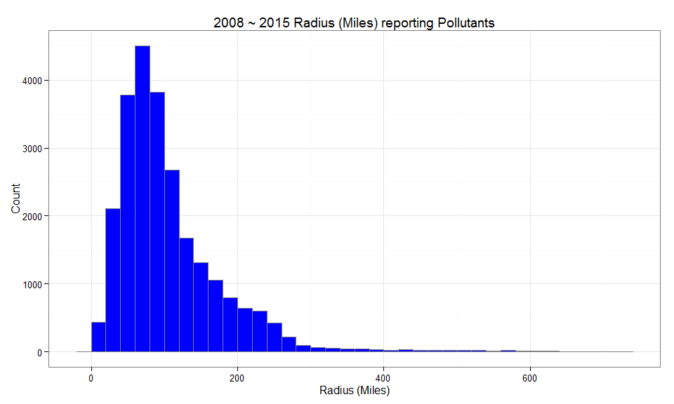 

```r
m2<-ggplot(pollutant,aes(x=radius,fill=yr))+geom_histogram(binwidth=20,color="grey50") +
      facet_wrap(~yr) +
      labs(title="Radius (Miles) reporting Pollutants by Year",x="Radius (Miles)",y="Count") +
      theme_bw()
m2
```

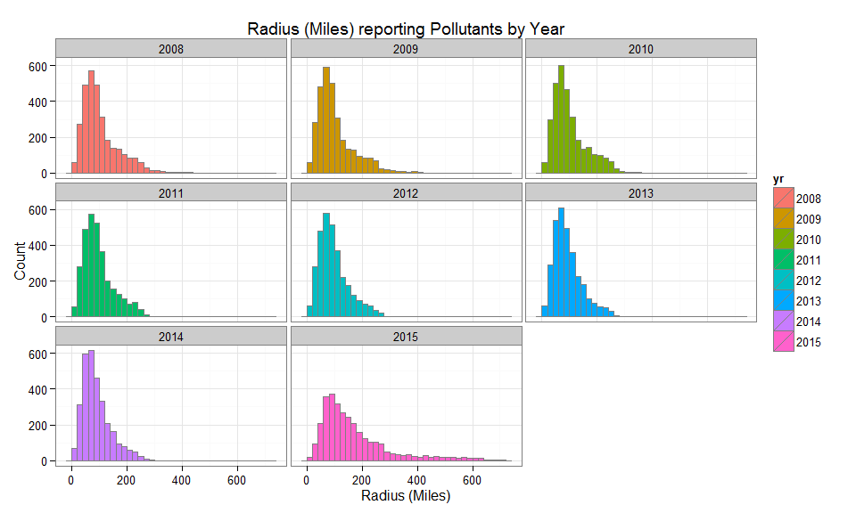 

## ggplot Maps

With a little re-arranging we a can chart the levels and radii trends for Ozone and PM2.5 using first ggplot(). We tidy the data and merge counties information from the map_data("county"). Observing that reporting for 2015 is not complete, we will base comparisons and trends up to 2014 at this time.


```r
# time to tydy the data
pollutant %>% gather("type","level",7:8) -> pollutant
names(pollutant)[3:4]<-c("id","region")
#
m.usa <- map_data("county")
m.usa <- m.usa[ ,-5]
names(m.usa)[5] <- 'region'
```

We are now ready to chart these county ggplots...We will slightly adapt the scales as indicated to produce meaningful ranges of Ozone and PM2.5 (in ppm) and radii (in miles). 


```r
g1 <- ggplot(subset(pollutant,type=="Ozone"), aes(map_id = region)) +
  geom_map(aes(fill = level), map = m.usa) + expand_limits(x = m.usa$long, y = m.usa$lat) +
  scale_fill_gradientn("ppm",colours=brewer.pal(9,"YlGnBu"))
g1 <- last_plot() + coord_map() + facet_wrap(~ yr,nrow=3) +
  labs(title="Ozone Pollutant level by County, ppm",x="",y="")+ theme_bw()
g1$scales$scales[[1]]$limits<-c(0,0.07)
g1
```

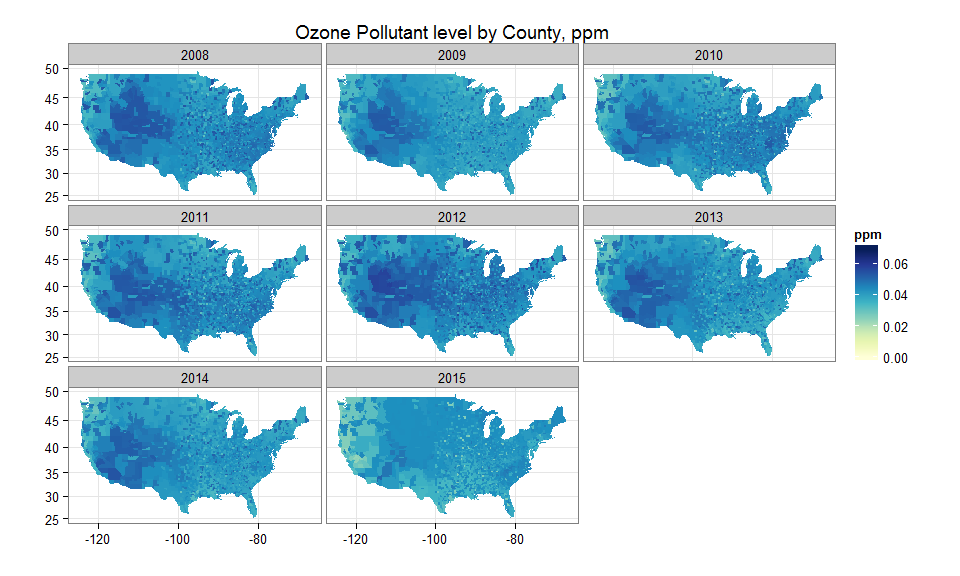 
We observe: West/Southwest highest but decreasing Ozone levels over the 2008-2014 period.

```r
g2 <- ggplot(subset(pollutant,type=="PM2p5"), aes(map_id = region)) +
  geom_map(aes(fill = level), map = m.usa) + expand_limits(x = m.usa$long, y = m.usa$lat) +
  scale_fill_gradientn("ppm",colours=brewer.pal(9,"YlGnBu"))
g2 <- last_plot() + coord_map() + facet_wrap(~ yr,nrow = 3) +
  labs(title="PM2.5 Pollutant level by County, ppm",x="",y="")+ theme_bw()
g2$scales$scales[[1]]$limits<-c(0,21)
g2
```

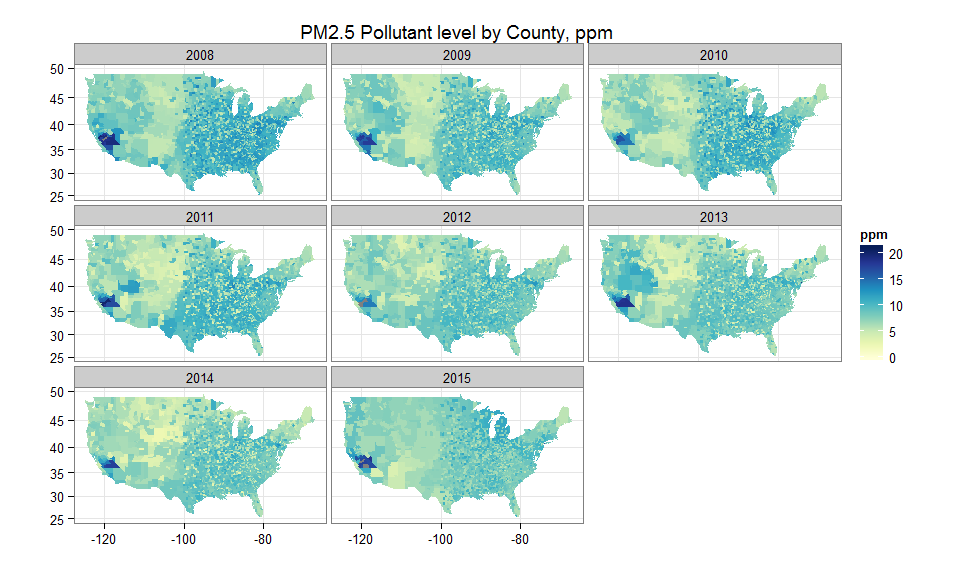 
We observe: California highest levels, Western US shows low levels of PM2.5.

```r
g3 <- ggplot(subset(pollutant,type=="Ozone"), aes(map_id = region)) +
  geom_map(aes(fill = radius), map = m.usa) + expand_limits(x = m.usa$long, y = m.usa$lat) +
  scale_fill_gradientn("Miles",colours=brewer.pal(9,"YlGnBu"))
g3 <- last_plot() + coord_map() + facet_wrap(~ yr,nrow = 3) +
  labs(title="2008 ~ 2015 Radius reporting Pollutant by County, Miles",x="",y="") + theme_bw()
g3$scales$scales[[1]]$limits<-c(0,400)
g3
```

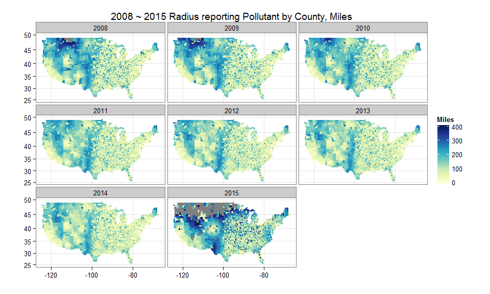 
We observe generally decreasing radius, indicating data collection density increases. Grey color represents radius in excess of 400 miles.

```r
subset(pollutant,type=="Ozone" & yr %in% c(2010,2014)) %>%
  group_by(id,region,yr) %>%
  select(-type,-radius) %>%
  as.data.frame -> t
t$yr<-as.character(t$yr)
t$yr<-paste0("Y",t$yr)
t %>% spread(yr,level) %>% mutate(level.change=Y2014-Y2010) -> t

g4 <- ggplot(t, aes(map_id = region)) + geom_map(aes(fill = level.change), map = m.usa) +
  expand_limits(x = m.usa$long, y = m.usa$lat) +
  scale_fill_gradientn("ppm",colours=brewer.pal(9,"YlGnBu"))
g4 <- last_plot() + coord_map() +
        labs(title="2010 ~ 2014 Ozone Pollutant Level Change by County, ppm",x="",y="")+ theme_bw()
g4$scales$scales[[1]]$limits<-c(-0.010,0.01)
g4
```

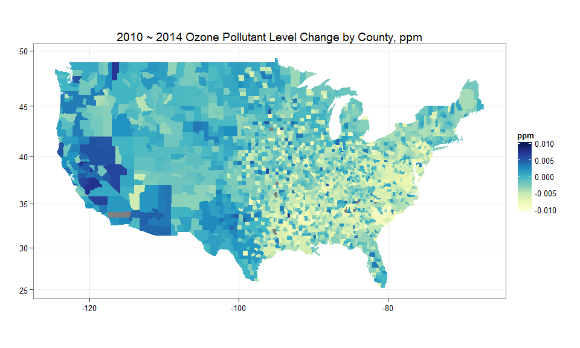 
We note, over 2010-2014, Western US shows worsening while Eastern US shows improving Ozone levels.

```r
subset(pollutant,type=="PM2p5" & yr %in% c(2010,2014)) %>%
  group_by(id,region,yr) %>%
  select(-type,-radius) %>%
  as.data.frame -> t
t$yr<-as.character(t$yr)
t$yr<-paste0("Y",t$yr)
t %>% spread(yr,level) %>% mutate(level.change=Y2014-Y2010) -> t

g5 <- ggplot(t, aes(map_id = region)) + geom_map(aes(fill = level.change), map = m.usa) +
  expand_limits(x = m.usa$long, y = m.usa$lat) +
  scale_fill_gradientn("ppm",colours=brewer.pal(9,"YlGnBu"))
g5 <- last_plot() + coord_map() +
  labs(title="2010 ~ 2014 PM2.5 Pollutant Level Change by County, ppm",x="",y="")+ theme_bw()
g5$scales$scales[[1]]$limits<-c(-4,4)
g5
```

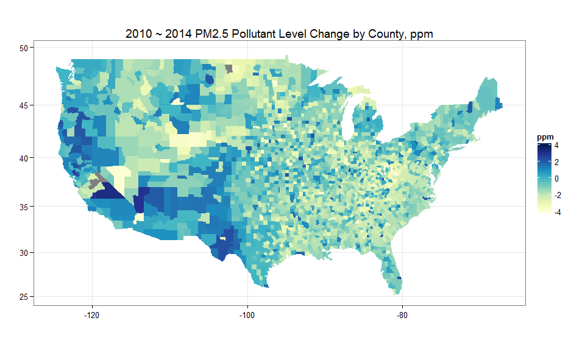 
We note, over 2010-2014, Southwest shows worsening while North-Central US and Midwest show improving PM2.5 levels.

```r
subset(pollutant,yr %in% c(2010,2014)) %>%
  group_by(id,region,yr) %>%
  select(-type,-level) %>%
  unique %>%
  as.data.frame -> t
t$yr<-as.character(t$yr)
t$yr<-paste0("Y",t$yr)
t %>% spread(yr,radius) %>% mutate(radius.change=Y2014-Y2010) -> t

g6 <- ggplot(t, aes(map_id = region)) + geom_map(aes(fill = radius.change),map = m.usa) +
  expand_limits(x = m.usa$long, y = m.usa$lat) +
  scale_fill_gradientn("Miles",colours=brewer.pal(9,"YlGnBu"))
g6 <- last_plot() + coord_map() +
  labs(title="2010 ~ 2014 Radius reporting Pollutant Change by County, Miles",x="",y="") + theme_bw()
g6$scales$scales[[1]]$limits<-c(-200,200)
g6
```

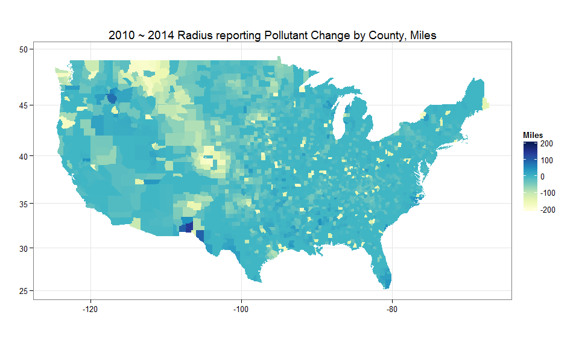 

```r
rm(m.usa) # cleanup
```
We observe some significant improvements in CO (arapahoe, denver, adams...),

```r
head(t[order(t$radius.change), ], 10, addrownums = FALSE)
```

```
##           lon      lat       id     region    Y2010     Y2015
## 227 -104.6889 39.64247 colorado   arapahoe 218.3803  21.66127
## 233 -104.8871 39.73921 colorado     denver 206.9454  17.20032
## 221 -104.6211 39.87180 colorado      adams 219.9444  33.40823
## 207 -103.9712 39.24188 colorado     elbert 246.4280  66.54129
## 240 -105.0952 39.35511 colorado    douglas 201.5075  29.74580
## 242 -105.2001 39.47554 colorado  jefferson 193.9689  23.44929
## 237 -105.0451 39.98195 colorado broomfield 196.9444  30.98158
## 157 -102.6266 39.34814 colorado kit carson 294.5524 131.17645
## 188 -103.4590 38.90765 colorado    lincoln 258.0934 102.36305
## 214 -104.4224 40.41759 colorado       weld 222.4992  70.08007
##     radius.change
## 227     -196.7190
## 233     -189.7451
## 221     -186.5362
## 207     -179.8867
## 240     -171.7617
## 242     -170.5196
## 237     -165.9628
## 157     -163.3760
## 188     -155.7303
## 214     -152.4192
```
and degradations in ND (divide, burke, mountrail,...) and MT (sheridan, richland).

```r
tail(t[order(t$radius.change), ], 10, addrownums = FALSE)
```

```
##           lon      lat           id    region     Y2010    Y2015
## 226 -104.6665 47.93255      montana  richland  93.76708 579.4643
## 143 -102.4381 47.60624 north dakota      dunn  66.14310 558.0431
## 181 -103.2988 48.00286 north dakota  mckenzie  60.46663 576.9340
## 102 -101.6470 48.72481 north dakota  renville 109.87447 627.8183
## 222 -104.6380 48.75871      montana  sheridan 102.40774 623.3193
## 107 -101.7281 48.39747 north dakota      ward  92.08654 613.5227
## 189 -103.4602 48.10385 north dakota  williams  61.24037 582.7381
## 150 -102.5202 48.05274 north dakota mountrail  62.86422 587.1816
## 145 -102.4587 48.73006 north dakota     burke 104.06226 633.5181
## 184 -103.3960 48.76116 north dakota    divide  83.09438 628.1797
##     radius.change
## 226      485.6973
## 143      491.9000
## 181      516.4674
## 102      517.9438
## 222      520.9116
## 107      521.4362
## 189      521.4977
## 150      524.3174
## 145      529.4559
## 184      545.0854
```

## Retrieving county Data for 50 US States

Finally, we attempt another approach with choroplethr, athough there is little data for AK and HI... we want to undertake the challenge to visualize not only the lower 48 but also the 49th and 50th US states... This requires a download of the complete county list for all states, a dataset available from the [US Census and data repository](http://www.census.gov/en.html).


```r
pollutant<-data.frame()
set.seed(1)    # for reproducible example
# this creates an example formatted as a pollutant.map
datadir<-"./data" ; if (!file.exists("data")) { dir.create("data") } # data will reside in subdir
url<-"http://www2.census.gov/geo/docs/maps-data/data/gazetteer/Gaz_counties_national.zip"
filename <- paste(datadir,strsplit(url,"/")[[1]][length(strsplit(url,"/")[[1]])],sep="/")
download.file(url, dest=filename, mode="wb")
unzip (filename, exdir = datadir) # unzip creates and populates the data structure
unlink(filename) # remove the zip file
filename <-gsub(".zip",".txt",filename)
d <- read.delim(filename,header=TRUE,sep="\t",stringsAsFactors=FALSE) # populate data frame
# cleanup
rm(datadir,filename,url)
names(d)<-tolower(names(d))
subset(d,select=-c(ansicode:awater_sqmi)) %>%
  rename(state.abb=usps,region=geoid,lat=intptlat,lon=intptlong) -> d
d$region<-as.numeric(d$region)
data(county.regions)
df <- data.frame(county.regions)
subset(df,select=-c(county.fips.character,state.fips.character)) %>%
  merge(d,.,by=c("region","state.abb"),all=FALSE) -> df
# cleanup
rm(d,county.regions)
df[,c("lon","lat")] %>%
  screener %>%
  merge(df,.,by=c("lon","lat"),all=TRUE) %>%
  rename(state=state.name) %>%
  as.data.frame -> t -> pollutant
rm(df) # cleanup
```

We now have a pollutant data frame that can contain all 50 states counties, and are ready to checkout AK and HI...

## Checking Out AK and HI


```r
m1<-ggplot(subset(t,state %in% c("alaska","hawaii")),aes(x=Ozone)) +
    geom_histogram(binwidth=0.001,color="grey50",fill="blue") +
    xlim(c(0,0.07)) + facet_grid(state ~ yr) +
    labs(title="2008 ~ 2015 Ozone Pollutant Level Distribution",x="pollutant level (ppm)", y="Count") +
    theme_bw()
m1
```

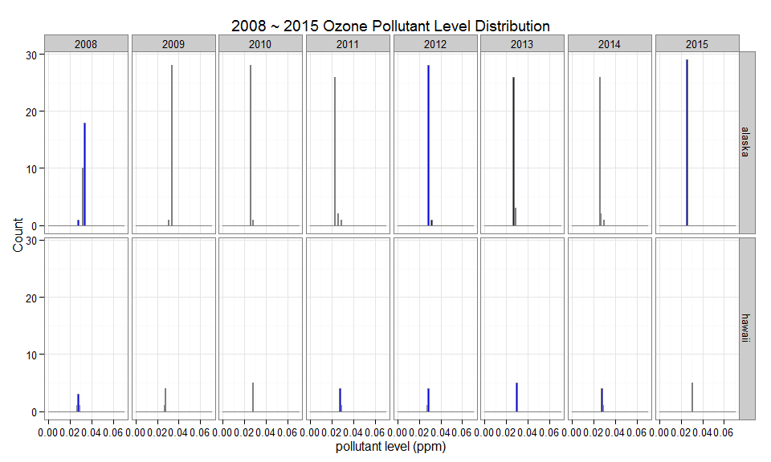 

```r
m2<-ggplot(subset(t,state %in% c("alaska","hawaii")),aes(x=PM2p5)) +
    geom_histogram(binwidth=1,color="grey50",fill="blue") +
    xlim(c(0,20)) + facet_grid(state ~ yr) +
    labs(title="2008 ~ 2015 PM2.5 Pollutant Level Distribution",x="pollutant level (ppm)",y="Count") +
    theme_bw()
m2
```

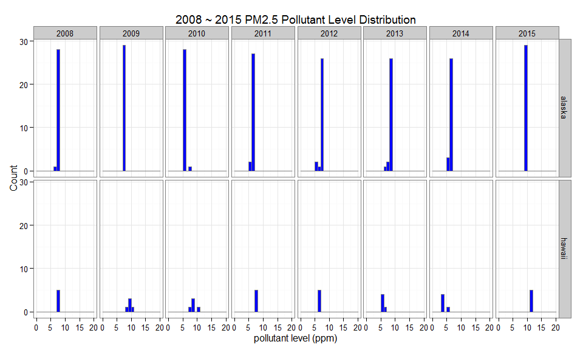 

```r
m3<-ggplot(subset(t,state %in% c("alaska","hawaii")),aes(x=radius)) +
    geom_histogram(binwidth=30,color="grey50",fill="blue") +
    xlim(c(0,3000)) + facet_grid(state ~ yr) +
    labs(title="2008 ~ 2015 Radius (Miles) reporting Pollutants",x="Radius (Miles)",y="Count") +
    theme_bw()
m3
```

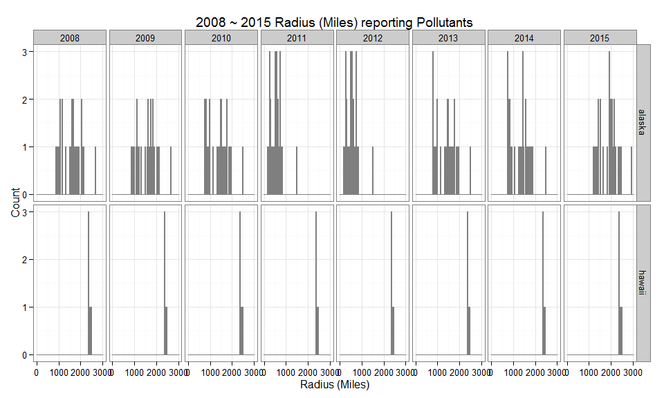 
We observe HI has no data reported, and radius values in excess of 2000 miles indicate most likely CA levels are reported. We also note AK has some reports below 500 miles which we retain for now in 2011 and 2012...

```r
m4<-ggplot(subset(t,state %in% c("alaska","hawaii") & radius <500),aes(x=radius)) +
    geom_histogram(binwidth=20,color="grey50",fill="blue") +
    facet_wrap(state ~ yr) +
    labs(title="Radius (Miles) reporting Pollutants by Year",x="Radius (Miles)",y="Count") + theme_bw()
m4
```

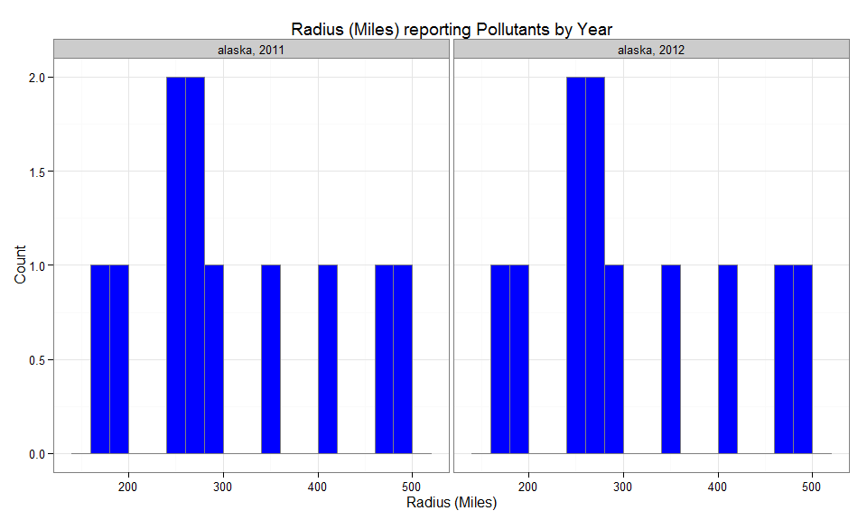 

## Radar Charts to the Rescue

To investigate an alternate screening method, we will now use a radar chart approach to capture min and max radii corresponding to the 5 nearest neighbors reporting the pollutants. We treat Ozone and PM2.5 as type variables.

```r
t$yr <- as.factor(t$yr)
t$state.abb <- as.factor(t$state.abb)
t %>% 
        select(state.abb, yr, radius, Ozone) %>%
        rename(level = Ozone) %>% 
        group_by(yr, state.abb) %>%
        summarise_each_(c("n_distinct", "mean", "min", "max"), c("radius", "level")) %>%
        mutate(type = "Ozone") -> temp
t %>% 
        select(state.abb, yr, radius, PM2p5) %>%
        rename(level = PM2p5) %>% 
        group_by(yr, state.abb) %>%
        summarise_each_(c("n_distinct", "mean", "min", "max"), c("radius", "level")) %>%
        mutate(type = "PM2p5") %>%
        rbind(.,temp) %>% as.data.frame -> t
t$type <- as.factor(t$type)
t %>%
  gather("radius.funs", "radius", c(3, 5, 7, 9)) %>%
  gather("level.funs", "level", 3:6) %>%
  as.data.frame-> t 
levels(t$radius.funs) <- levels(t$level.funs) <- c("n", "mean", "min", "max")
subset(t,select = -c(level.funs:level)) %>%
  rename(funs = radius.funs, value = radius) %>%
  mutate(metric="radius") -> temp
subset(t,select = -c(radius.funs:radius)) %>%
  rename(funs = level.funs, value = level) %>%
  mutate(metric="level") %>%
  rbind(.,temp) %>%
  as.data.frame %>%
  unique -> t
t$metric <- as.factor(t$metric)
rm(temp)   # cleanup
```
We observe there is absolutely no data reported from Hawaii and most data from Alaska is extremely distant, at about 800 miles... We now chart this information side by side in ggplots.

```r
data.frame(subset(t, type == "Ozone" & !funs=="n")) %>%
        rename(id=state.abb) %>% as.data.frame -> df
gg1 <- ggplot(df, aes(x=id, y=value)) + geom_point(aes(shape = funs, color = yr)) +
        labs(title = "US 50 States Ozone Level and Radius Statistics by State and Year") +
        theme(axis.text.x = element_text(angle = 90, hjust = 1, vjust = 0.5)) +
        facet_wrap( ~ metric,nrow=4,scales="free_y") 
gg1
```

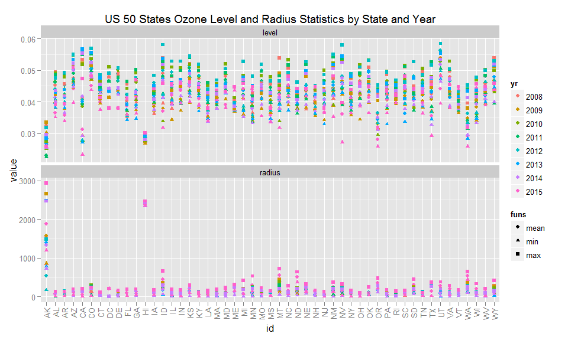 

```r
data.frame(subset(t, type == "PM2p5" & !funs=="n")) %>%
        rename(id=state.abb) %>% as.data.frame -> df
gg2 <- ggplot(df, aes(x=id, y=value)) + geom_point(aes(shape = funs, color = yr)) +
        labs(title = "US 50 States PM2.5 Level and Radius Statistics by State and Year") +
        theme(axis.text.x = element_text(angle = 90, hjust = 1, vjust = 0.5)) +
        facet_wrap( ~ metric,nrow=4,scales="free_y") 
gg2
```

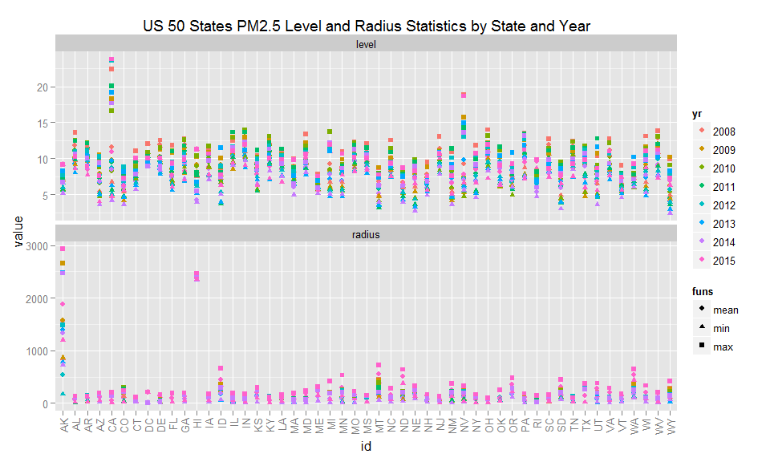 

```r
data.frame(subset(t, type == "Ozone" & !funs=="n" & !(state.abb %in% c("AK", "HI")))) %>%
        rename(id=state.abb) %>% as.data.frame -> df
gg3 <- ggplot(df, aes(x=id, y=value)) + geom_point(aes(shape = funs, color = yr)) +
        labs(title = "US Lower 48 Ozone Level and Radius Statistics by State and Year") +
        theme(axis.text.x = element_text(angle = 90, hjust = 1, vjust = 0.5))+
        facet_wrap( ~ metric,nrow=4,scales="free_y") 
gg3
```

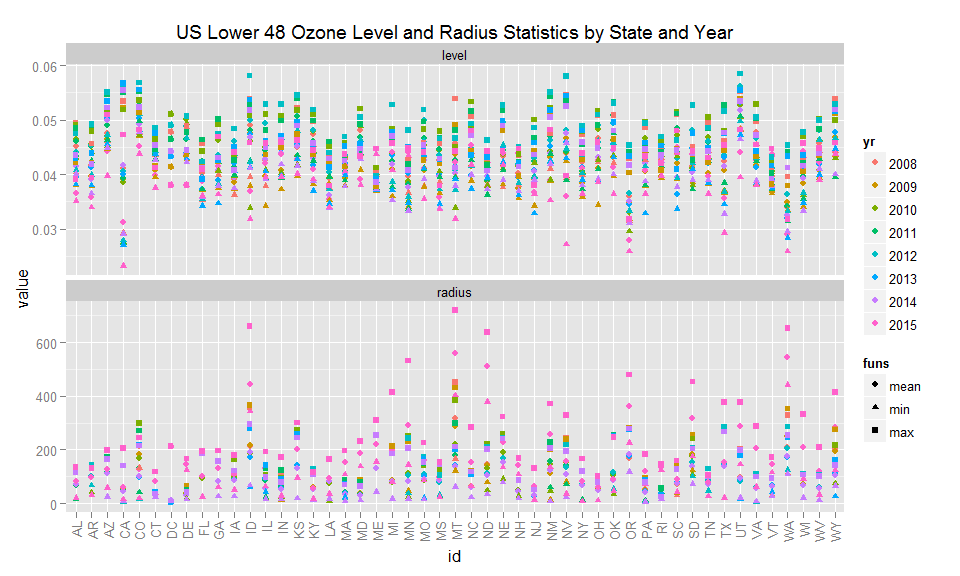 
We observe Radius reporting minimum is usually below 50 miles, with notable exceptions...

```r
data.frame(subset(t, type == "PM2p5" & !funs=="n" & !(state.abb %in% c("AK", "HI")))) %>%
        rename(id=state.abb) %>% as.data.frame -> df
gg4 <- ggplot(df, aes(x=id, y=value)) + geom_point(aes(shape = funs, color = yr)) +
        labs(title = "US Lower 48 PM2.5 Level and Radius Statistics by State and Year") + 
        theme(axis.text.x = element_text(angle = 90, hjust = 1, vjust = 0.5))+
        facet_wrap( ~ metric, nrow=4,scales="free_y") 
gg4
```

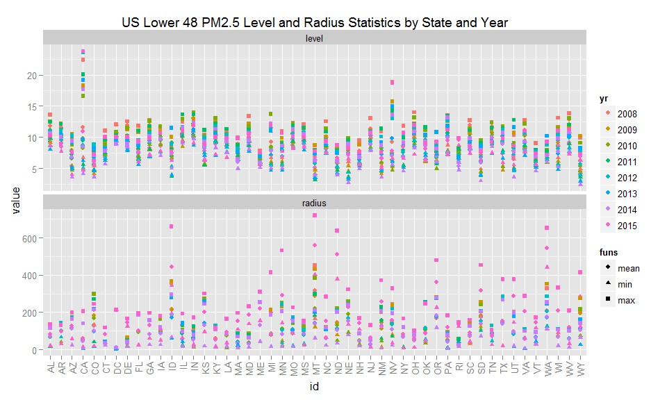 

```r
rm(df) # cleanup
```
To generate the radar charts, we will use again the ggplot function, and perform charts on the normalized data. We produce faceted charts by Year and superimpose on the chart Ozone and PM2.5

```r
# Define a new coordinate system 
coord_radar <- function(...) { 
        structure(coord_polar(...), class = c("radar", "polar", "coord")) 
} 
is.linear.radar <- function(coord) TRUE 

subset(t,funs!="n" & metric=="radius") %>%
  unique %>% rename(id=state.abb) -> y
y$value <-normalize(y$value)
rownames(y)<-NULL
ggplot(y,aes(x=id,y=value)) +
        geom_path(aes(group=type, color=funs)) +
        coord_radar()+facet_wrap(type ~ yr,nrow=4) +
        labs(title = "Annual Ozone and PM2.5 Radius Statistics for All 50 US States",x="",y="Normalized value") +
        theme(strip.text.x = element_text(size = rel(0.8)), axis.text.x = element_text(size = rel(0.8)))
```

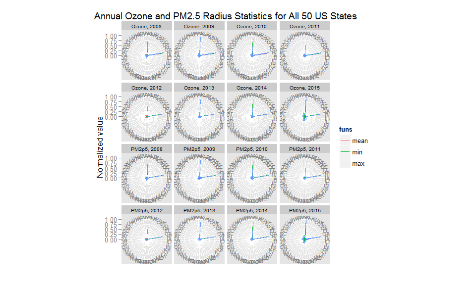 
We observe that both AK and HI exhibit very large radii, so let's exclude these...

```r
subset(t,funs!="n" & metric=="radius" & !state.abb %in% c("AK","HI")) %>%
  unique %>% rename(id=state.abb)-> y
y$value <-normalize(y$value)
rownames(y)<-NULL
ggplot(y,aes(x=id,y=value)) +
        geom_path(aes(group=type, color=funs)) +
        coord_radar()+facet_wrap(type ~ yr,nrow=4) +
        labs(title = "Annual Ozone and PM2.5 Radius Statistics for Lower 48 US States",x="",y="Normalized value") +
        theme(strip.text.x = element_text(size = rel(0.8)), axis.text.x = element_text(size = rel(0.8))) 
```

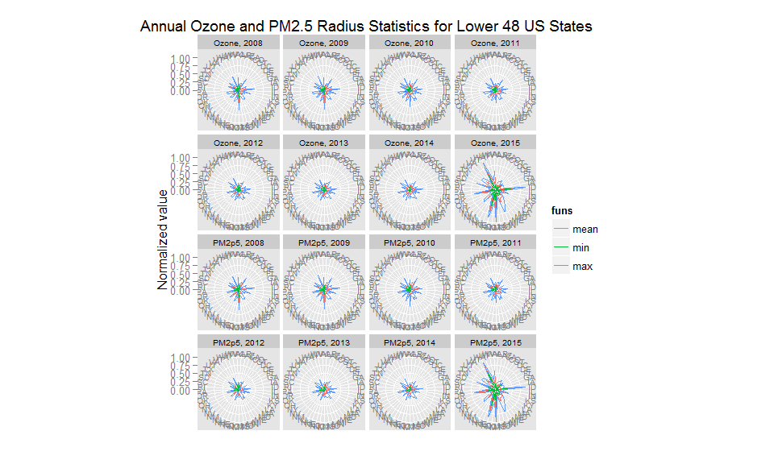 

```r
rm(y,t) # cleanup
```

## Choroplethr Approach with Animation

To perform this last step, we limit our observation to a radius less than 250 miles. This will provide visual support for the progress achieved between 2008 and 2015. Recognizing that such radius is quite large, we also map the current progress in collecting denser information. Levels of Ozone and PM2.5 and Radii evolutions are captured in a series of 8 annual charts, one for each variable, and animated with the chroroplethr player implemented with an html file.


```r
subset(pollutant,radius<250) %>% gather("type","value",9:10)  -> t
# the animated story...
choropleths<-list()
setwd(figdir) # point to ./figures sub directory
for (j in 2008:2015) {
        i<-j-2007
        df<-subset(t,type=="Ozone" & yr==as.character(j),select=c(region,value))
        choropleths[[i]]=county_choropleth(df, title = paste(as.character(j),"Ozone level (ppm) Reporting Radius < 250 Miles"), legend = "ppm level", num_colors = 1, state_zoom = NULL, county_zoom = NULL)
        choropleths[[i]]$scales$scales[[1]]$limits<-c(0,0.07)
        }        
for (j in 2008:2015) {
        i<-j-1999
        df<-subset(t,type=="PM2p5" & yr==as.character(j),select=c(region,value))
        choropleths[[i]]=county_choropleth(df, title = paste(as.character(j),"PM2.5 level (ppm) Reporting Radius < 250 Miles"), legend = "ppm level", num_colors = 1, state_zoom = NULL, county_zoom = NULL)
        choropleths[[i]]$scales$scales[[1]]$limits<-c(0,21)
        }        
for (j in 2008:2015) {
        i<-j-1991
        df<-subset(t,type=="Ozone" & yr==as.character(j),select=c(region,radius))
        df %>% rename(value=radius) -> df
        choropleths[[i]]=county_choropleth(df, title = paste(as.character(j),"Pollutant Reporting Radius (Miles)"), legend = "Miles", num_colors = 1, state_zoom = NULL, county_zoom = NULL)
        choropleths[[i]]$scales$scales[[1]]$limits<-c(0,250)
        }
choroplethr_animate(choropleths)
```

```
## [1] "All files will be written to the current working directory: P:/Developing Data Products/Pollution/Pollution_files/figure-html . To change this use setwd()"
## [1] "Now writing individual choropleth files there as 'choropleth_1.png', 'choropleth_2.png', etc."
```

```
## [1] "Now writing code to animate all images in 'animated_choropleth.html'.  Please open that file with a browser."
```

```r
setwd(userdir) # return to working directory
rm(t,df) # cleanup
```

The [choroplethr animation](./Pollution_files/figure-html/animated_choropleth.html) is provided with its own player. All figures have been written to the ./figure-html sub directory and can be viewed individually as well.

# Conclusions

This analysis shows definite trends and explores techniques to screen data content. ggmap and choroplethr visualization are complementing more common histograms, point charts and less frequently used, but powerful radar charts.
The next target will be to port this type of visualization to a shiny app and extend to other pollutants as selected dynamically in the application from the US EPA records.

# References

The following sources are referenced as they provided significant help and information to develop this analysis:

1. [Coursera Developing Data Product -  Week 4 yhat(Part1) by Roger D. Peng, PhD](https://class.coursera.org/devdataprod-015/lecture/69) 
2. [US EPA download site and data repositories](http://aqsdr1.epa.gov/aqsweb/aqstmp/airdata/download_files.html)
3. [US Census and data repository](http://www.census.gov/en.html)
4. [yhat](https://sandbox.yhathq.com/)
4. [choroplethr Package](http://cran.r-project.org/web/packages/choroplethr/choroplethr.pdf)
5. [stackoverflow ggplot/mapping US counties thread](http://stackoverflow.com/questions/23714052/ggplot-mapping-us-counties-problems-with-visualization-shapes-in-r)
6. [pbapply Package](http://cran.r-project.org/web/packages/pbapply/pbapply.pdf)
